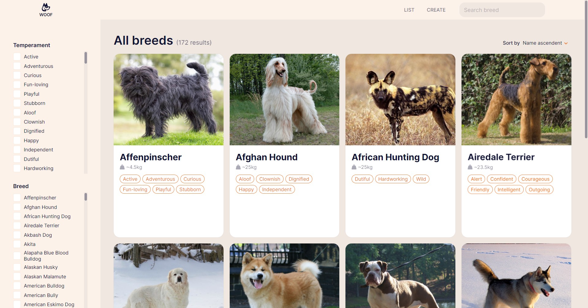
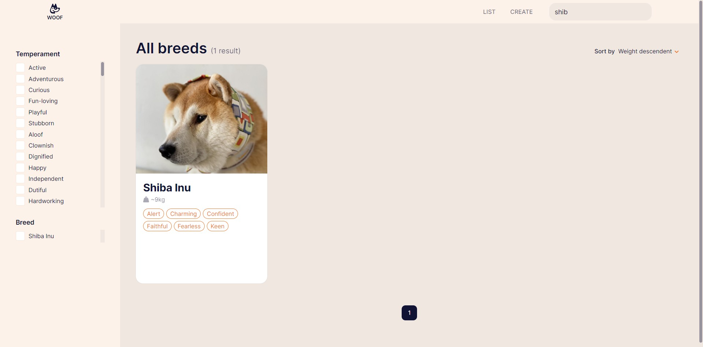
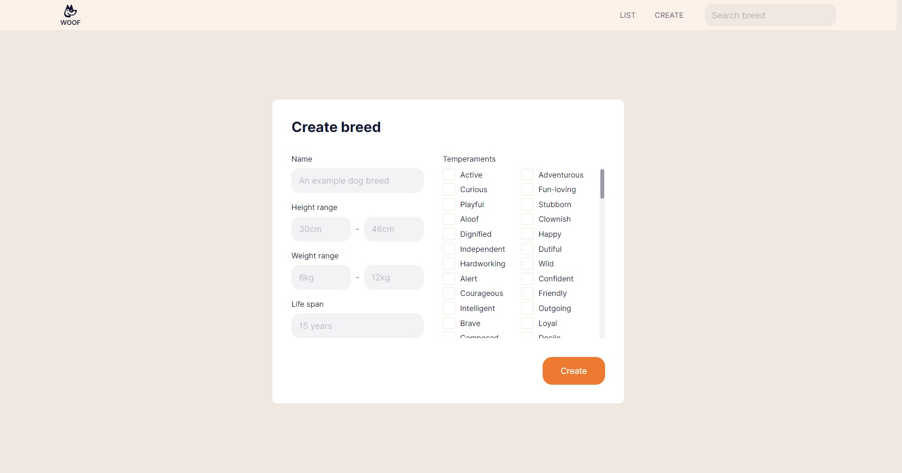

# woof

A Bootcamp challenge. [TheDogApi](https://thedogapi.com/) wrapper, with custom API and Client.

This project is just an <ins>initial release</ins>, so can be updated in a future with new features.

Client is a [React](https://reactjs.org/) app, with a [React Router](https://reacttraining.com/react-router/web/guides/quick-start) and [Redux](https://redux.js.org/).
API uses [Express](https://expressjs.com/), [Sequelize](https://sequelize.org/) and [PostgreSQL](https://www.postgresql.org/) as DB.

### Screenshots

Homepage


Breeds list


Filtering


Sort and filter at same time


Searching


Breed details


Creating a new breed


## Getting started

### Database and .env files setup

Firstly, you must create a postgresql database. Then go `api` folder and `client` folder, rename `.example.env` file to `.env`, and then fill in the database credentials.

### Running locally in development mode

To get started, just clone the repository and run:

```sh
git clone https://github.com/facuparedes/woof.git

cd ./api
npm install
npm start

cd ../client
npm install
npm start
```

Note: If you are running on Windows and you have issues with `fsevents`, run install --noptional flag (i.e. npm install --no-optional) which will skip installing fsevents.

### Building and deploying in production

If you wanted to run this site in production, you should install modules then build the site with npm run build and run it with `serve`:

#### Linux & MacOS

```sh
cd ./client
npm install
npm run build

npm install -g serve
serve -s build
```

#### Windows

```sh
cd ./client
npm install
npm run build

npm install -g serve
serve -s build
```

Note: You should run npm run build again any time you make changes to the site.

## Todo

- [x] Homepage
- [x] List breeds
  - [x] Filter breeds
  - [x] Sort breeds
  - [x] Search breeds
  - [x] Show breed's temperaments
- [x] Show breed's details
- [x] Create breeds
  - [ ] Custom images
- [ ] Edit breeds
- [ ] Delete breeds
